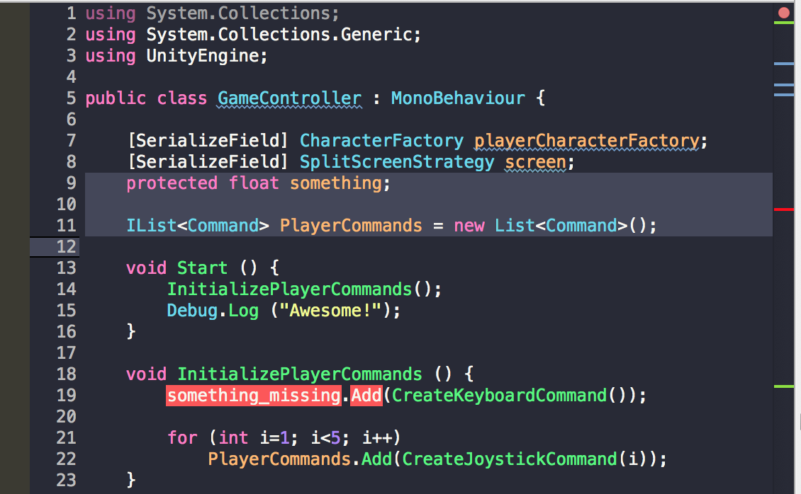

# Dracula for [MonoDevelop](http://monodevelop.com)

> A dark theme for [MonoDevelop](http://monodevelop.com).

## Install

All instructions can be found at [draculatheme.com/monodevelop](https://draculatheme.com/monodevelop).

## Team

This theme is maintained by the following person(s) and a bunch of [awesome contributors](https://github.com/dracula/monodevelop/graphs/contributors).

 |
--- |
[Gabriel Le Breton](https://github.com/gableroux) |

## License

[MIT License](./LICENSE)
